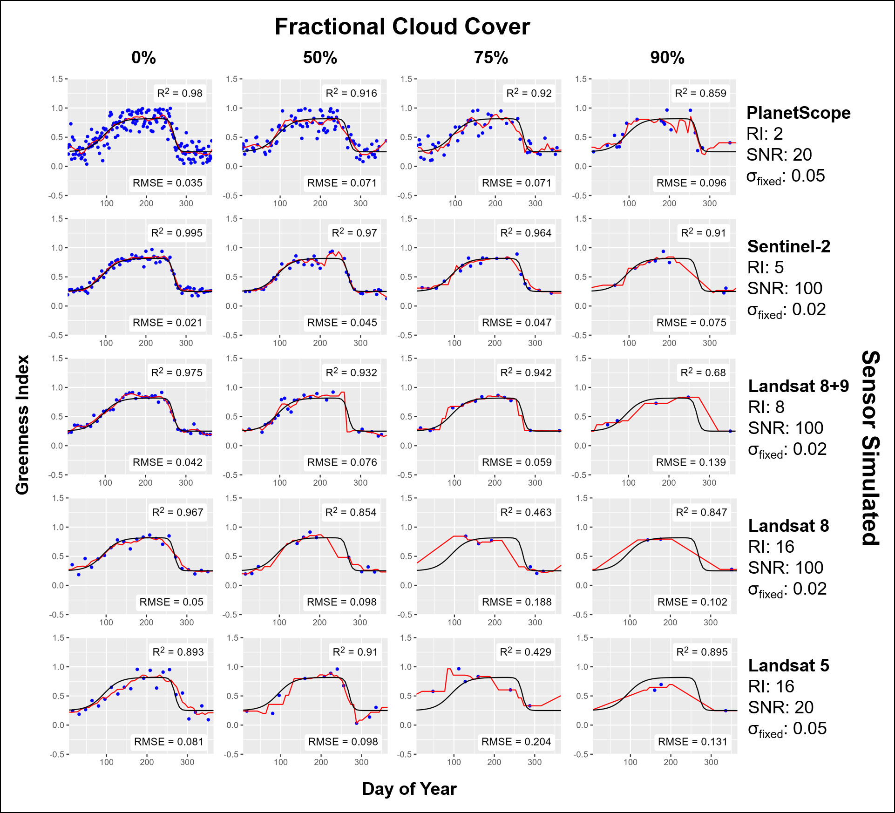
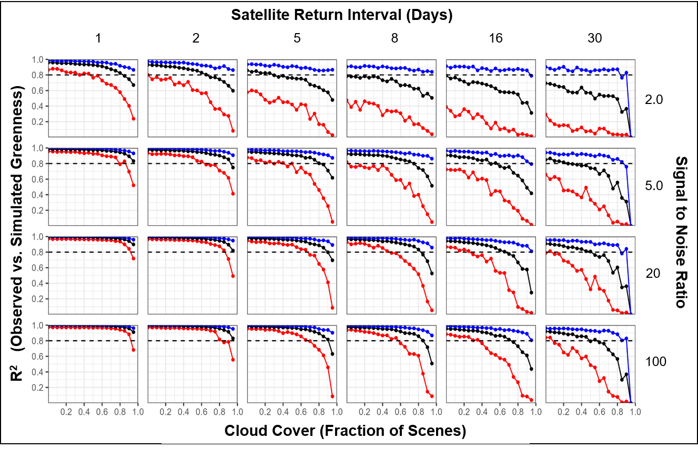

# Phenology Retrieval - Sensitivity Simulations

Tests the sensitivity of local polynomial regression phenology retrieval method to cloud cover and sensor / algorithmic noise. 

Examples of simulated phenology retrievals from several multispectral satellites with a range of cloud cover values:

Variation in R^2 between underlying and simulated phenology curves for a range of values in cloud cover, imaging frequency, and sensor noise. Red and blue lines are the lower and upper 5th percentiles and black lines are the medians of all simulated R^2 values for each set of parameters. 

Brief file description:

phenology_fit_tester.R

- Core code for performing simulations
- Relies on a parameter file (phenology_fit_test_parameters.csv) which includes the range of parameter values to simulate over
- For more information on parameters, see associated manuscript.

inter_sensor_comparison.R

- compares Landsat, Sentinel-2, and MODIS phenology estimates from Earth Engine

data_prep_for_manuscript.R

- generates small tiles of line plots for R^2 values in each simulated sensor

initial_figure_prep.R

- all other figures for manuscript

Citation:
